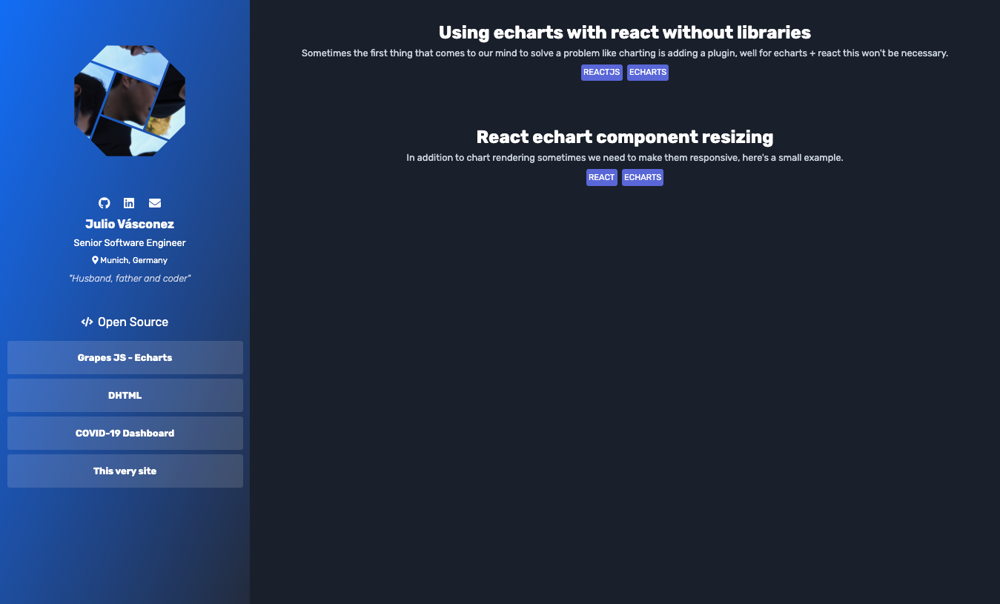
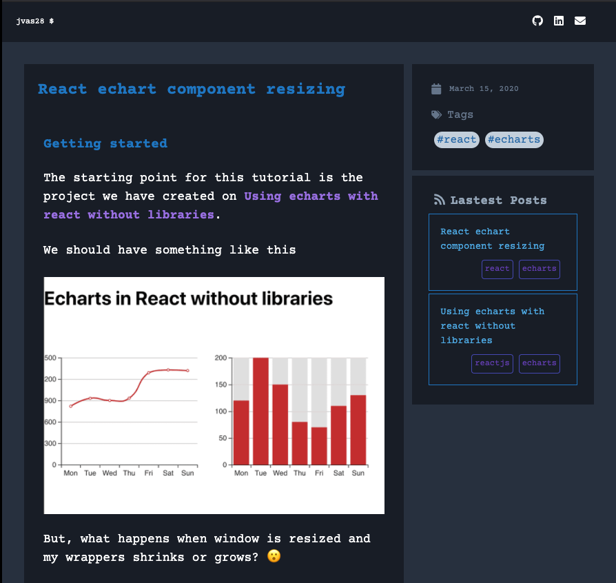

# Personal Website (vascone.dev) 
This is my personal site, made with Gatsby JS and love :two_hearts:	. 

From a long time ago I'm aiming to have my own website where I can put my projects and some writings, because I love to share what I know even if I don't consider my self a Software Jedi. :grin: 

I have still a lot of work in my mind for this project, but this is a starting point. :rocket:

If you'd like to use it feel free to fork it :smirk:

## What have I used on this site?
- [Gatsby JS](https://github.com/gatsbyjs/gatsby)
- [Typed.js](https://github.com/mattboldt/typed.js)
- [Disection Puzzles](https://github.com/lmgonzalves/dissection-puzzles)

## License
MIT
