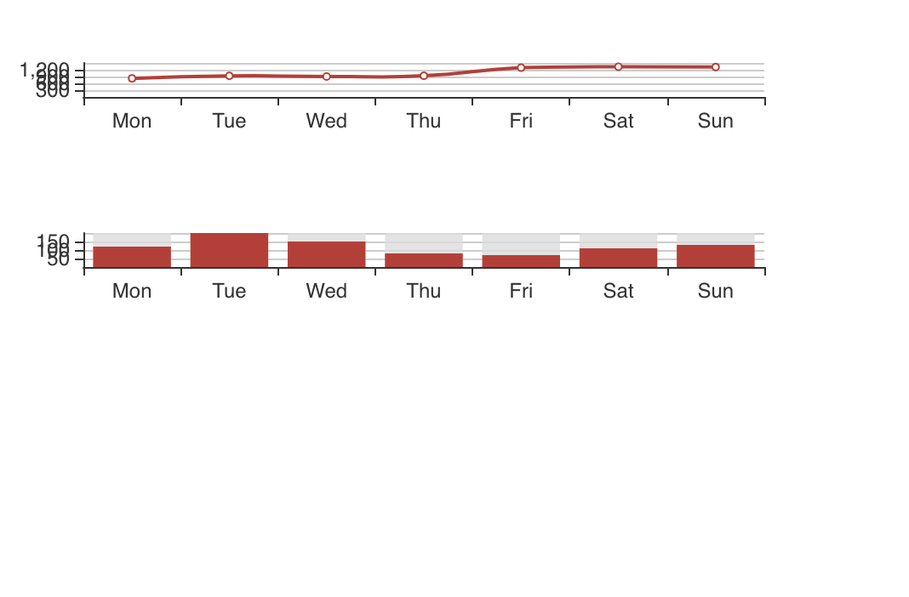
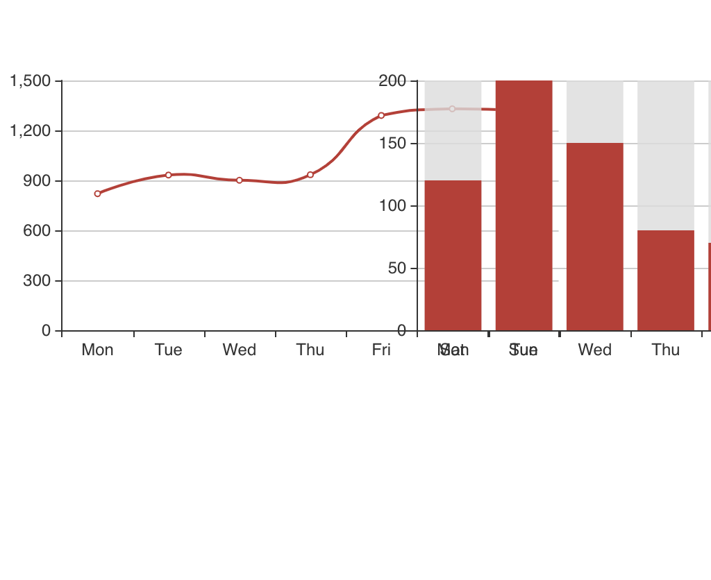

# Getting started
The focus of this micro-tutorial is how to render echarts components in a React application so for tutorial purposes let's start by creating a React application using `create-react-app`.
```bash
create-react-app echarts
cd echarts
```
Now we have our basic react project ready, it's time to add echarts dependency by running.
```bash
npm i echarts  
```         
Note: Adding is needed `--save` just in case you have npm lower than `5.0.0`.

I like to watch every small change I do in my browser so I'll start my server. 
```bash
npm start
```
### Getting our hands dirty
 Let's create a new component called `Chart.js`, for the tutorial I'll place it in `src`.
```javascript
import React from "react";
import echarts from "echarts";
export default function Chart() {
  return (
    <div
      style={{
        width: "100%",
        height: "100%",
      }}
    ></div>
  );
}
```
As echarts uses DOM element to create it's instance we'll use `useRef` hook to provide the component access to this element.
```javascript
import React, { useRef } from "react";
export default function Chart() {
  const myChart = useRef(null);
    
  return (
    <div
      ref={myChart}
      style={{
          width: "100%",
          height: "100%",
        }}
    ></div>
  );
}

```
Now we have our reference to DOM element so we can give echarts our Reference, but we need to use `useEffect` hook so we don't execute it in every render.
```javascript
import React, { useRef, useEffect } from "react";
import echarts from "echarts";

export default function Chart() {
  const myChart = useRef(null);
  useEffect(() => {
    const chart = echarts.init(myChart.current);
  }, []);

  return (
    <div
      ref={myChart}
      style={{
        width: "100%",
        height: "100%",
      }}
    ></div>
  );
}

```

At this point we have an instance of echarts running on our application, but as you should know echarts works with options that defines the charts.

I'll put this options as property so we can create multiple charts based on this component.

```javascript
import React, { useRef, useEffect } from "react";
import PropTypes from "prop-types";
import echarts from "echarts";

function Chart({ options }) {
  const myChart = useRef(null);
  useEffect(() => {
    const chart = echarts.init(myChart.current);
    chart.setOption(options);
  }, [options, resizeObserver]);

  return (
    <div
      ref={myChart}
      style={{
        width: "100%",
        height: "100%",
      }}
    ></div>
  );
}

Chart.propTypes = {
  options: PropTypes.any,
};

export default Chart;

```
Well now we can call our component like this.

```javascript
import Chart from './Chart.js'
const MyComponent= () => <div><Chart options={ChartOptions}/></div>
```
Let' create a folder called `charts` and two files inside:
`line.js`
```javascript
export default {
  xAxis: {
    type: "category",
    data: ["Mon", "Tue", "Wed", "Thu", "Fri", "Sat", "Sun"],
  },
  yAxis: {
    type: "value",
  },
  series: [
    {
      data: [820, 932, 901, 934, 1290, 1330, 1320],
      type: "line",
      smooth: true,
    },
  ],
};

```

`bars.js`
```javascript
export default {
  xAxis: {
    type: "category",
    data: ["Mon", "Tue", "Wed", "Thu", "Fri", "Sat", "Sun"],
  },
  yAxis: {
    type: "value",
  },
  series: [
    {
      data: [120, 200, 150, 80, 70, 110, 130],
      type: "bar",
      showBackground: true,
      backgroundStyle: {
        color: "rgba(220, 220, 220, 0.8)",
      },
    },
  ],
};

```
Have done this, we import our whole new Chart Component, which is ready to get some chart rendered.
```javascript
import React from "react";
import Chart from "./Chart";
import line from "./charts/line";
import bars from "./charts/bars";
import "./App.css";

function App() {
  return (
    <div className="App">
      <Chart options={line} />
      <Chart options={bars} />
    </div>
  );
}

export default App;
```
At this point you should have something like this



I doesn't looks amazing, but we have initialized echarts in our react component, and now we can style the wrapper to make them fit as we want.

```javascript
import React from "react";
import Chart from "./Chart";
import line from "./charts/line";
import bars from "./charts/bars";
import "./App.css";

function App() {
  return (
    <>
      <h1>Echarts in React without libraries</h1>
      <div className="App" style={{ display: "flex", flexDirection: "row" }}>
        <div style={{ width: "50%", height: 300 }}>
          <Chart options={line} />
        </div>
        <div style={{ width: "50%", height: 300 }}>
          <Chart options={bars} />
        </div>
      </div>
    </>
  );
}

export default App;

```


There you go! Now it looks much better!


In the next tutorial we'll learn how to make this charts to respond to resizing :rocket:

[React echart component resizing](/posts/2).


