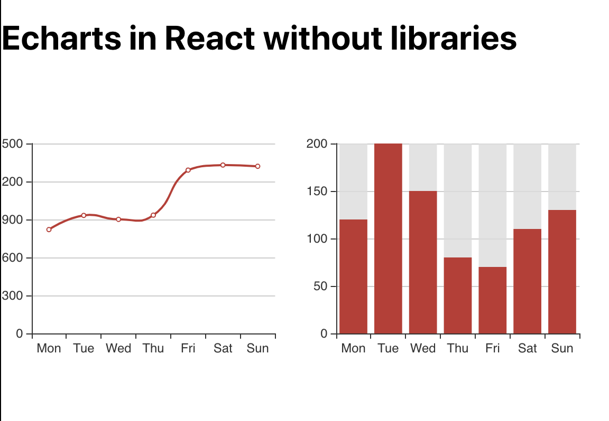

#Getting started
The starting point for this tutorial is the project we have created on
[Using echarts with react without libraries](/posts/1).

We should have something like this



But, what happens when window is resized and my wrappers shrinks or grows? :open_mouth:


Tada! :poop:, yeah shit happens...

So let's fix this behaviour

I found 2 ways to do it, probably there are more, but I'll explain only this 2

- 1. Using [Resize Observer API](https://developer.mozilla.org/en-US/docs/Web/API/Resize_Observer_API) a solution for modern browsers.
- 2. Using `window.onrize` event.

As I normally work for modern browsers my favorite is the first and is shorter too...

### Using Resize Observer API 
I'll create a new file for the observer at `utils/resizeObserver.js`
```javascript
import echarts from "echarts";
export default new ResizeObserver((entries) => {
  entries.map(({ target }) => {
    const instance = echarts.getInstanceByDom(target);
    if (instance) {
      instance.resize();
    }
  });
});
```  
This file will return a `ResizeObserver` that will catch all resize events of the DOM Element registered to be observed by it.

Inside the observer we receive the `entries` argument which are the list of observed DOM Elements that are being resized.

Also I'm using `echarts.getInstanceByDom` to use the target element to get the current echart instance and resize the chart corresponding to the resized element. 

Let's import react observer in our `App` Component and send it as property to our charts, so we use same observer for both. 
 ```javascript
import React from "react";
import Chart from "./Chart";
import line from "./charts/line";
import bars from "./charts/bars";
import resizeObserver from "./utils/resizeObserver";
import "./App.css";
function App() {
  return (
    <>
      <h1>Echarts in React without libraries</h1>
      <div className="App" style={{ display: "flex", flexDirection: "row" }}>
        <div style={{ width: "50%", height: 300 }}>
          <Chart options={line} resizeObserver={resizeObserver} />
        </div>
        <div style={{ width: "50%", height: 300 }}>
          <Chart options={bars} resizeObserver={resizeObserver} />
        </div>
      </div>
    </>
  );
}

export default App;

```
Then there's only one more thing to do, register our DOM Elements to the `Resize Observer`.

```javascript
import React, { useRef, useEffect } from "react";
import PropTypes from "prop-types";
import echarts from "echarts";

function Chart({ options, resizeObserver }) {
 ....
  useEffect(() => {
    const chart = echarts.init(myChart.current);
    chart.setOption(options);
    if (resizeObserver) resizeObserver.observe(myChart.current);
  }, [options, resizeObserver]);
....

Chart.propTypes = {
  options: PropTypes.any,
  resizeObserver: PropTypes.oneOfType([PropTypes.func, PropTypes.object]),
};

export default Chart;

```
We only need to add the property `resizeObserver` and then use it to register the DOM Element inside `UseEffect` Hook.

And now we have resizable charts :wink:
